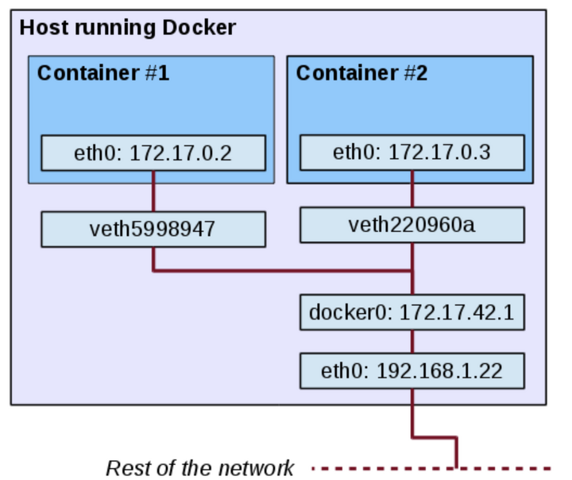

### Version check
```
#docker -v  
Docker version 19.03.8, build afacb8b
```
---
### Command
```
#docker images   // 도커 엔진에 존재하는 이미지의 목록 출력
```
> 무작위 16진수 Hash 값은 컨테이너의 고유 ID, 너무 길어 앞 12자리정도만 사용.

```
#docker start [image]    // 컨테이너 시작
#docker attach [image]   // 컨테이너 내부로 들어가기
```

```
#docker create -i -t name test centos:7
#docker run -i -t name test centos:7
```
-i interactive  
-t tty

> run과 create의 차이  
run     : 이미지가 없는 경우 PULL -> create -> start -> attach (-i -t 사용 시)  
create  : 이미지가 없는 경우 PULL -> create

---
### Container List
```
#docker ps
#docker ps -a // 정지된 컨테이너 포함 확인
```
```
#docker ps -a
CONTAINER ID        IMAGE               COMMAND             CREATED             STATUS                  PORTS                NAMES
a0f914725191        ubuntu:14.04        "/bin/bash"         3 days ago          Up 3 days               0.0.0.0:80->80/tcp   webserver
77cf269593b5        ubuntu:14.04        "/bin/bash"         3 days ago          Exited (0) 3 days ago   
```
```
#docker rename [old] [new]
```  
---
### Remove
```
#docker rm [container]    // 중지 후 사용 가능
#docker rm -f [container] // 중지 후 제거
#docker container prune   // 모든 컨테이너 제거
```
```
#docker ps -a -q    // -q ID만 출력  
#docker stop $(docker ps -a -q)   
#docker rm $(docker ps -a -q)     // 변수 활용 모든 컨테이너 제거
```
---
### Network
```
root@a0f914725191:/# ifconfig
eth0      Link encap:Ethernet  HWaddr 02:42:ac:11:00:02  
          inet addr:172.17.0.2  Bcast:172.17.255.255  Mask:255.255.0.0
          UP BROADCAST RUNNING MULTICAST  MTU:1500  Metric:1
          RX packets:8 errors:0 dropped:0 overruns:0 frame:0
          TX packets:0 errors:0 dropped:0 overruns:0 carrier:0
          collisions:0 txqueuelen:0
          RX bytes:656 (656.0 B)  TX bytes:0 (0.0 B)

lo        Link encap:Local Loopback  
          inet addr:127.0.0.1  Mask:255.0.0.0
          UP LOOPBACK RUNNING  MTU:65536  Metric:1
          RX packets:0 errors:0 dropped:0 overruns:0 frame:0
          TX packets:0 errors:0 dropped:0 overruns:0 carrier:0
          collisions:0 txqueuelen:1000
          RX bytes:0 (0.0 B)  TX bytes:0 (0.0 B)

```
> 172.17.0 IP 대역을 순차적으로 사용함
---
### Port Forwarding
```
#docker -run -i -t --name [name] -p [host port]:[container port] [container]
```
> [HOST IP]:[HOST PORT]:[CONTAINER PORT] 형식으로 사용 가능
---
### Practice
```
#docker run -d --name wordpressdb -e MYSQL_ROOT_PASSWORD=password \
-e MYSQL_DATABASE=wordpress mysql:5.7

#docker run -d -e WORDPRESS_DB_PASSWORD=password --link wordpressdb:mysql \
-p 80 wordpress
...
```
> -d  // Detached 모드로 컨테이너를 실행. 입출력이 없는 상태로 컨테이너가 실행되며, forefround로 실행됨.

> -e  // 컨테이너 내부의 환경변수를 설정한다. 입출력이 불가능한 (-d) 컨테이너일 경우 exec를 이용한다.

```
#docker exec -i -t [container] /bin/bash    // 컨테이너 내부 커멘드 실행  
#echo $MYSQL_ROOT_PASSWORD   
root@6aa19058d220:/# echo $MYSQL_ROOT_PASSWORD  
password  // 민감한 정보는 secret 기능을 사용한다.
```

> --link 옵션은 컨테이너의 IP가아닌 Alias를 이용해 접근하도록 설정한다.


```
#docker ps
CONTAINER ID        IMAGE               COMMAND                  CREATED              STATUS              PORTS                   NAMES
33c6e05719bf        wordpress           "docker-entrypoint.s…"   About a minute ago   Up About a minute   0.0.0.0:32768->80/tcp   unruffled_curran
6aa19058d220        mysql:5.7           "docker-entrypoint.s…"   3 minutes ago        Up 3 minutes        3306/tcp, 33060/tcp     wordpressdb
```
> 0.0.0.0:32768->80/tcp 포트 정보 확인, #docker port [container] 로 확인 가능하다.  
> link 옵션은 container의 실행 순서의 의존성도 정의한다.  
> ex) #docker start [WEB] -> ERROR      DB -> WEB


