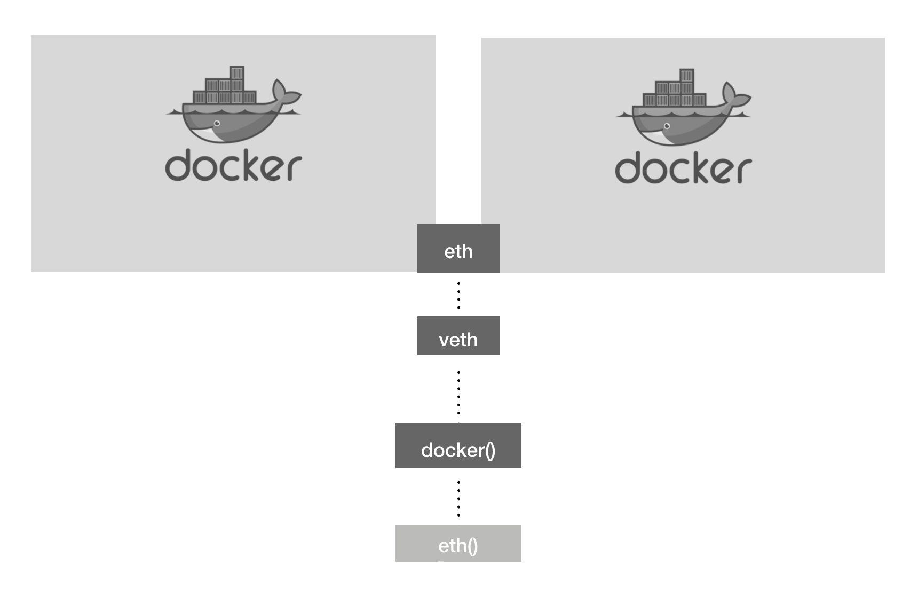

### Volume Share
```
#docker run -d --name db_volume -e MYSQL_ROOT_PASSWORD=password -e MYSQL_DATABASE=wordpress -v /home/wordpress_db:/var/lib/mysql mysql:5.7
```
```
#docker run -d -e WORDPRESS_DB_PASSWORD=password --name wordpress_volume --link db_volume:mysql -p 80 wordpress
```
> -v 옵션을 이용하여 호스트 볼륨과 컨테이너 볼륨을 연결  
> -v|--volume[=[[HOST-DIR:]CONTAINER-DIR[:OPTIONS]]]   
> ex)  -v /home/wordpress_db:/var/lib/mysql
> 호스트의 디렉토리를 클라이언트에 마운트 한다.
> --volume-from 으로 새로운 컨테이너에 볼륨 공유가 가능하다.
> --mount 옵션도 동일한 기능

```
#docker volume create --name test_volume
test_volume
// 볼륨 생성

#docker volume ls
DRIVER              VOLUME NAME
local               test_volume
```
```
#docker run -i -t --name myvolume-1 -v test_volume:/root/ centos:centos7
#docker run -i -t --name myvolume-2 -v test_volume:/root/ centos:centos7
```
> myvolume-1, 2 컨테이너 모두 Host의 test_volume 볼륨을 /root 디렉토리에 마운트하여 사용한다.
---

```
#docker inspect --type volume test_volume
[
    {
        "CreatedAt": "2020-04-19T21:53:58+09:00",
        "Driver": "local",
        "Labels": {},
        "Mountpoint": "/var/lib/docker/volumes/test_volume/_data",
        "Name": "test_volume",
        "Options": {},
        "Scope": "local"
    }

```
> 생성한 Docker 볼륨이 실제 저장되는 경로를 확인 한다.

```
#docker volume prune          // 볼륨 전체 삭제
WARNING! This will remove all local volumes not used by at least one container.
Are you sure you want to continue? [y/N]
```
---

### Network Function
```
#yum -y install bridge-utils
#brctl show docker0
bridge name	bridge id		     STP enabled	interfaces
docker0		8000.02428cdd9205	 no		        veth2c11d85
							                            veth360bdad
							                            veth4adf633
```
> brctl을 이용하여 docker0 브리지에 veth가 바인딩 되었는지 확인할 수 있다.

```
#docker network ls
NETWORK ID          NAME                DRIVER              SCOPE
936e998a112b        bridge              bridge              local
c3f63598a399        host                host                local
c6f32b47196a        none                null                local

#docker network inspect bridge
[
    {
        "Name": "bridge",
        "Id": "936e998a112bfc907c766f9d0c64d49d4fae2376c661f86c9eaca2a3a51a1d2b",
        "Created": "2020-04-15T19:05:53.264693365+09:00",
        "Scope": "local",
        "Driver": "bridge",
        "EnableIPv6": false,
        "IPAM": {
            "Driver": "default",
            "Options": null,
            "Config": [
                {
                    "Subnet": "172.17.0.0/16",
                    "Gateway": "172.17.0.1"
                }
            ]
...
```
> Subnet, Gateway, Container 의 Network 정보를 확인 할 수 있다.

```
#docker network create --driver bridge d3bridge
e63d098df3df1c337d5a03bfc398d3ad0dd8d75f9f1d1665b0cab564d87ef289

#docker run -i -t --name bridge_test --net d3bridge ubuntu:14.04

root@e754001f84ae:/# ifconfig
eth0      Link encap:Ethernet  HWaddr 02:42:ac:12:00:02  
          inet addr:172.18.0.2  Bcast:172.18.255.255  Mask:255.255.0.0
          UP BROADCAST RUNNING MULTICAST  MTU:1500  Metric:1
          RX packets:6 errors:0 dropped:0 overruns:0 frame:0
          TX packets:0 errors:0 dropped:0 overruns:0 carrier:0
          collisions:0 txqueuelen:0
          RX bytes:516 (516.0 B)  TX bytes:0 (0.0 B)
...
#docker network disconnect d3bridge bridge_test
#docker network connect d3bridge bridge_test
```
> 새로운 대역의 IP주소가 추가 되었다.
> 임의로 생성한 브릿지 네트워크를 컨테이너에 붙였다 뗄 수 있다.

```
#docker network create --driver=bridge --subnet=100.100.100.0/24 --ip-range=100.100.100.0/24 --gateway=100.100.100.1 my_network
```
> 서브넷, 게이트웨이 등을 임의로 지정하여 생성할 수 있다.

```
docker run -i -t --name host_network --net host ubuntu:14.04
```
> 호스트의 네트워크를 사용하며,  호스트네임도 호스트와 동일하다.
> 별도의 포트포워딩 없이 서비스가 가능하다.
> --net none 옵션으로 외부와 단절된 컨테이너를 사용할 수 있다.

```
#docker run -i -t -d --name network_container_1 ubuntu:14.04
#docker run -i -t -d --name network_container_2 --net container:network_container_1 ubuntu:14.04

#docker exec network_container_1 ifconfig
eth0      Link encap:Ethernet  HWaddr 02:42:ac:11:00:08  
          inet addr:172.17.0.8  Bcast:172.17.255.255  Mask:255.255.0.0
          UP BROADCAST RUNNING MULTICAST  MTU:1500  Metric:1
          RX packets:8 errors:0 dropped:0 overruns:0 frame:0
          TX packets:0 errors:0 dropped:0 overruns:0 carrier:0
          collisions:0 txqueuelen:0
          RX bytes:656 (656.0 B)  TX bytes:0 (0.0 B)

#docker exec network_container_2 ifconfig
eth0      Link encap:Ethernet  HWaddr 02:42:ac:11:00:08  
          inet addr:172.17.0.8  Bcast:172.17.255.255  Mask:255.255.0.0
          UP BROADCAST RUNNING MULTICAST  MTU:1500  Metric:1
          RX packets:8 errors:0 dropped:0 overruns:0 frame:0
          TX packets:0 errors:0 dropped:0 overruns:0 carrier:0
          collisions:0 txqueuelen:0
          RX bytes:656 (656.0 B)  TX bytes:0 (0.0 B)
```
>--net container 옵션으로 다른 컨테이너의 네트워크 네임스페이스 환경을 공유 한다. 공유되는 속성은 IP, MAC 등이다. 추가적으로 내부 IP를 할당받지 않으며 호스트에 가상 인터페이스(veth)도 생성되지 않는다.



### Bridge Network
```
#docker network create --driver=bridge --subnet=100.100.100.0/24 --ip-range=100.100.100.0/24 --gateway=100.100.100.1 my_network
#docker run -i -t -d --name net_alias_container_1 --net my_network --net-alias test ubuntu:14.04
#docker run -i -t -d --name net_alias_container_2 --net my_network --net-alias test ubuntu:14.04
#docker run -i -t -d --name net_alias_container_3 --net my_network --net-alias test ubuntu:14.04
```
> bridge 타입의 네트워크 my_network를 생성한다.
> my_network를 사용하는 컨테이너를 사용하는데, --net-alias로 별칭을 만들어 사용한다.

```
#docker run -i -t --name net_alias_container_4 --net my_network ubuntu:14.04

root@30e84d83f9a9:/# ping -c 1 test
PING test (100.100.100.3) 56(84) bytes of data.
64 bytes from net_alias_container_2.my_network (100.100.100.3): icmp_seq=1 ttl=64 time=0.118 ms

root@30e84d83f9a9:/# ping -c 1 test
PING test (100.100.100.2) 56(84) bytes of data.
64 bytes from net_alias_container_1.my_network (100.100.100.2): icmp_seq=1 ttl=64 time=0.106 ms
```
> 도커 엔진에 내장된 DNS(127.0.0.11)를 이용하여 test라는 alias로 지정된 컨테이너에 핑테스트를 진행하면, 라운드로빈 방식으로 응답이 오는 것을 확인 할 수 있다.
